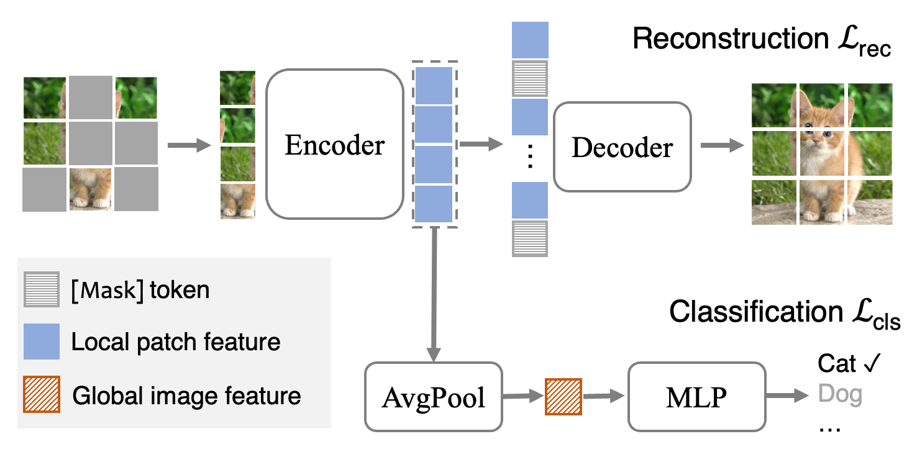
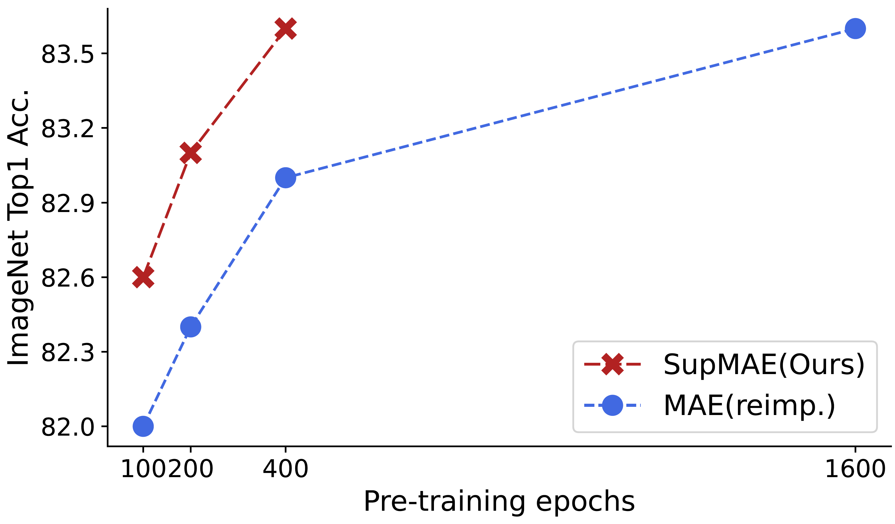

## SupMAE: Supervised Masked Autoencoders Are Efficient Vision Learners




This is a offical PyTorch/GPU implementation of the paper [SupMAE: Supervised Masked Autoencoders Are Efficient Vision Learners](https://arxiv.org/abs/2205.14540).

* This repo is a modification on the [MAE repo](https://github.com/facebookresearch/mae). Installation and preparation follow that repo.

* This repo is based on [`timm==0.3.2`](https://github.com/rwightman/pytorch-image-models), for which a [fix](https://github.com/rwightman/pytorch-image-models/issues/420#issuecomment-776459842) is needed to work with PyTorch 1.8.1+.

### TL;DR

Supervised MAE (SupMAE) is an extension of MAE by adding a supervised classification branch. SupMAE is efficient and can achieve comparable performance with MAE using only 30% compute.



### Abstract

Self-supervised Masked Autoencoders (MAE) are emerging as a new pre-training paradigm in computer vision. MAE learns semantics implicitly via reconstructing local patches, requiring thousands of pre-training epochs to achieve favorable performance. This paper incorporates explicit supervision, i.e., golden labels, into the MAE framework. The proposed Supervised MAE (SupMAE) only exploits a visible subset of image patches for classification, unlike the standard supervised pre-training where all image patches are used. SupMAE is efficient and can achieve comparable performance with MAE using only 30% compute when evaluated on ImageNet with the ViT-B/16 model. Detailed ablation studies are conducted to verify the proposed components.

### Catalog

- [x] Pre-training code
- [x] Fine-tuning code
- [x] Pre-trained checkpoints & logs

### Pre-trained checkpoints & logs

Due to computation constraint, we ONLY test the ViT-B/16 model. 

|            | Pre-training | Fine-tuning |
|------------|:------------:|:-----------:|
| checkpoint |     [ckpt](https://drive.google.com/file/d/1YwcTJvASZJvn2LxyZZG4PcgXaBCKEv_4/view?usp=sharing) <br /> md5: <tt>d83c8a</tt>  |     [ckpt](https://drive.google.com/file/d/1G-7lEJKDItXxQ3aytpwWC8WBAFwzKryO/view?usp=sharing) <br /> md5: <tt>1fb748</tt>    |
| logs       |      [log](./misc/pretrain_log.txt)     |     [log](./misc/finetune_log.txt)     |


### Pre-training

The pre-training instruction is in [PRETRAIN.md](PRETRAIN.md).

### Fine-tuning 

The fine-tuning instruction is in [FINETUNE.md](FINETUNE.md).

### Citation
If you find this repository helpful, please consider citing our work
```
@article{liang2022supmae,
  title={SupMAE: Supervised Masked Autoencoders Are Efficient Vision Learners},
  author={Liang, Feng and Li, Yangguang and Marculescu, Diana},
  journal={arXiv preprint arXiv:2205.14540},
  year={2022}
}
```


### License

This project is under the CC-BY-NC 4.0 license. See [LICENSE](LICENSE) for details.
